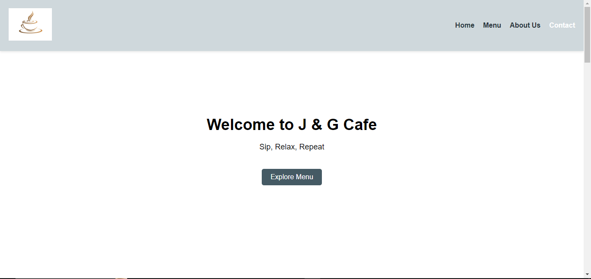
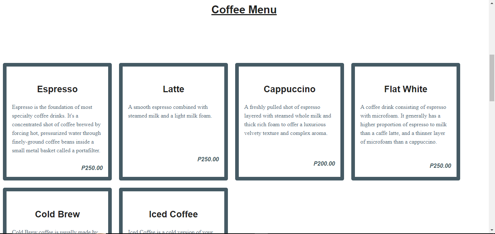
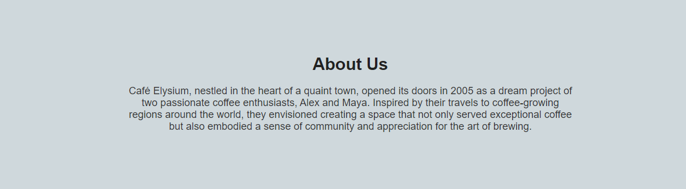
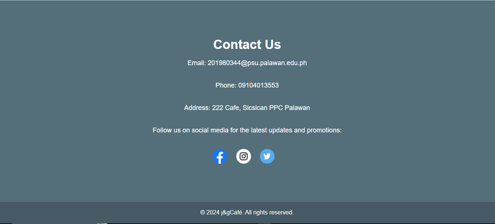

# Cozy-Cup-Cafe

## Project Description
Cozy Cup Cafe is a web application designed to enhance the cafe experience for both customers and cafe owners. It provides a user-friendly platform for customers to browse the menu, place orders, and enjoy a seamless cafe experience. Cafe owners can manage their menu, track orders, and connect with their customers efficiently.

## Features
- Menu Management: Easily update and manage the cafe menu, including adding new items, updating prices, and marking items as unavailable.
- Order Placement: Customers can browse the menu, add items to their cart, and place orders with just a few clicks.
- Order Tracking: Real-time order tracking for both customers and cafe owners, ensuring a smooth and transparent order fulfillment process.
- Customer Engagement: Cafes can engage with their customers by sending notifications, promotions, and personalized offers.
- User Authentication: Secure user accounts with authentication for both customers and cafe owners.
- Feedback System: Gather valuable feedback from customers through a built-in review and rating system.

## Screen Captures

Description: Welcome to [J & G Cafe], where every cup tells a story! Step into our cozy sanctuary, where the aroma of freshly brewed coffee fills the air, and the warm embrace of community awaits. Indulge in our carefully curated menu of artisanal coffees, delectable pastries, and savory treats, crafted with love and passion. Whether you're seeking a tranquil space to work, catch up with friends, or simply unwind with a good book, our inviting atmosphere and friendly staff ensure a memorable experience with each visit. Join us in celebrating life's simple pleasures, one sip at a time. Welcome home to [J & G Cafe].

Description: Discover the perfect brew to start your day or indulge in a moment of bliss at [J & G Cafe]. Our exquisite coffee menu features an array of tantalizing options to suit every palate. From velvety lattes and robust espressos to creamy cappuccinos and aromatic pour-overs, each cup is expertly crafted using premium beans sourced from around the world. Elevate your coffee experience with our customizable selections, including dairy-free alternatives and indulgent syrups. Whether you prefer a bold and invigorating blend or a smooth and mellow roast, we invite you to savor the rich flavors and enticing aromas that await you at [J & G Cafe].

Description: At [J & G Cafe], our story is brewed from a passion for community, quality, and the art of coffee. Nestled in the heart of [222 Cafe, Sicsican PPC Palawan], our journey began with a simple dream: to create a welcoming space where friends could gather, conversations could flow, and every cup served would be a moment of joy. From our humble beginnings to becoming a beloved local hotspot, we remain committed to our values of authenticity and excellence. With each sip, bite, and smile exchanged, we invite you to be a part of our story and experience the warmth and camaraderie that defines [J & G Cafe]. Welcome to our family.

Description: Have a question, comment, or just want to say hello? We'd love to hear from you! Reach out to us at [J & G Cafe] through any of the channels below. Whether you prefer to drop by in person, give us a call, or send us a message online, our friendly team is here to assist you. Your feedback matters to us, as we strive to make every visit to [J & G Cafe ] memorable and enjoyable. Get in touch today and let's start a conversation.

# About the Authors

**Name: IAN GABRIEL F. DALIMOCON**

**Email:** fetalverian@gmail.com

Connect with me on:
- [Email](mailto:fetalverian@gmail.com)
- 
- 

**Name: Jay Evan Willis Lagutan**

**Email:** jaylagutan02@gmail.com

Connect with me on:
- [Email](mailto:jaylagutan02@gmail.com)
- 
- 

